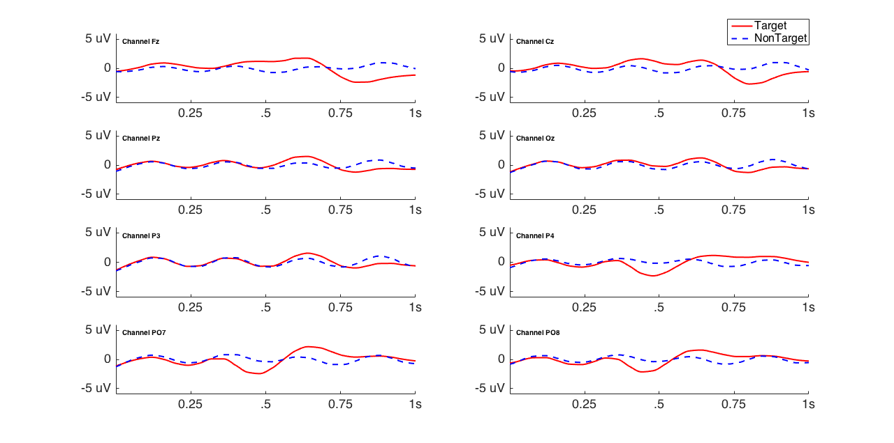

# Analisis de datos de P300 obtenidos x OpenVibe

* Dispositivo: g.Tec
* Frecuencia de muestreo: 250 Hz
* Filtro butterworth: 1-30 Hz
* Notch Filter: 50 Hz

# Experimento

El experimento se desarrollo segun los siguientes parametros:

* 7 palabras de 5 letras cada una.  Cada ''trial'' es un intento de Tx una letra.
* 120 flashes de filas y columnas de la matriz de P300. 20 corresponden a hits.
* Tiempo entre flash y flash: 0.125 ms.
* Tiempo entre trial y trial: 10 s
* Tiempo total: 1434.563 s
* Canales: 'Fz'    'Cz'    'Pz'    'Oz'    'P3'    'P4'    'PO7'    'PO8'

# Procesamiento de OpenVibe

El Write Streamer genera un archivo en formato OV2. OpenVibe provee una funcion para 
convertir este formato al formato de matlab '''convert_ov2mat'''.

Asi el dataset que se genera contiene las siguientes estructuras

* samples: La matriz de EEG, de 358372 x 8 canales
* sampleTime: las marcas de tiempo de 358372 x 1.
* stims: Las estimulaciones generadas en OpenVibe de 21495 x 3.  No solo contiene las estimulaciones
de filas y columnas sino que tambien tiene informacion adicional generada por OpenVibe (estado de los canales, inicio fin de cada evento, etc). Esta 
estructura provee tres datos. El timestamp con la ocurrencia de la estimulacion, el ID de la estimulacion y la duracion (que aparece siempre en cero en este experimento, ya que el manejo de los inicios y fin de cada bloque se administran con ID de estimulaciones distintos).

De estos datos surge el procedimiento para procesar offline los datos:

* Identificar y separar los trials
* Determinar en samples las posiciones de inicio y fin de cada flash
* Segmentar
* Epoching (promediar p.t.p. los diferentes segmentos).
* Generar los features
* Clasificar.
* Validar

# Procesamiento de OpenVibe

En la captura del dataset, se determin? que hay un trial adicional que se col?, y que hay eliminar.
As? se limitan solamente a 4200 targets y est?mulos correspondientes (7 x 5 x 120)

# Resultados

El promedio punto a punto de los hits (700) vs nohits (3500) da

 

Se ve la se?al de P300 principalmente en los dos canales occipitales.

